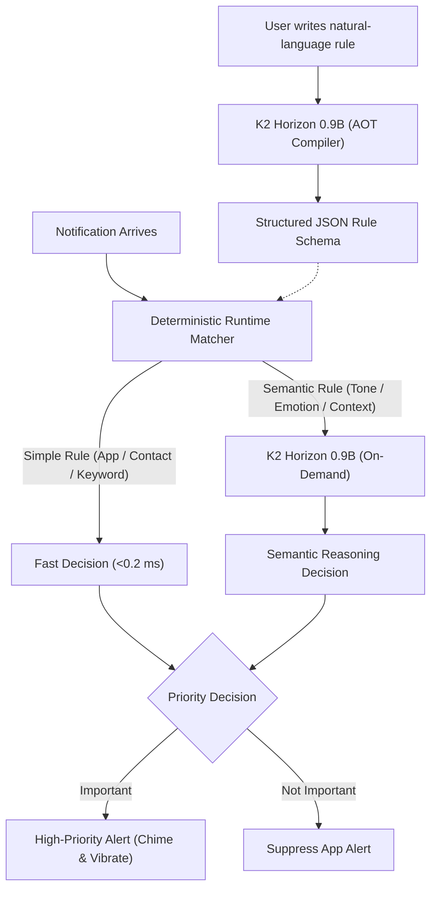

# K2 Horizon: On-Device Intelligent Edge Notification Assistant

[](LICENSE)
[](https://huggingface.co/IFM/K2-Horizon-0.9B)
[](https://github.com/ggerganov/llama.cpp)

An on-device intelligent notification analysis and alerting engine for Android powered by **K2 Horizon 0.9B** and embedded **llama.cpp**.

---

## Overview

Modern mobile users face continuous notification fatigue. Standard device muting silences everything indiscriminately, risking missed emergency messages, work escalations, or important personal communications.

**K2 Horizon Notification Assistant** enables users to define custom notification priorities using plain English (e.g., *"if any msg from madhu it is important, if she sends reels it is not important"*). When an incoming notification matches an active rule, the system triggers a **high-priority audio chime and custom vibration—even when the device notification volume is muted or set to zero**.

### Core Technical Architecture

Running raw neural network inference over every incoming notification is impractical for battery-powered mobile devices. This project implements a **Hybrid Ahead-of-Time (AOT) Rule Compilation Architecture**:

K2 Horizon acts primarily as an **Ahead-of-Time Rule Compiler**. When a user adds or edits a rule, K2 Horizon parses the natural-language intent once, compiling it into a structured JSON rule schema. Incoming notifications are then evaluated against this schema in memory by a deterministic fast classifier in `<0.2 ms`. If and only if a rule explicitly demands tone, sentiment, or emotional nuance (e.g., *"any message from pranav when he is angry it is not important"*), the fast classifier routes the message to K2 Horizon on demand for deep semantic reasoning.

---

## Key Features

- **Natural-Language Rule Authoring**: Define complex notification priority policies in everyday English without writing regex or complex logical scripts.
- **Ahead-of-Time (AOT) Rule Compilation**: K2 Horizon parses rule intent once when rules are created or edited, compiling it into structured JSON matching schemas.
- **Deterministic Fast-Path Execution**: Evaluates app filters, contact names, keywords, and exclusion criteria in `<0.2 ms` with zero GPU/NPU overhead.
- **Selective On-Demand Semantic Reasoning**: Invokes K2 Horizon only when emotional tone, sarcasm, or contextual intent requires deep reasoning.
- **High-Priority Media Alerting**: Bypasses system notification mute settings using custom audio/vibration channels for urgent alerts.
- **Local Notification Log**: On-device history tracking matching decisions, latency, and rule evaluations.
- **Configurable Retention**: User-configurable log history retention to manage device storage.
- **100% Offline & Private**: Zero external network requests, zero telemetry, and no `INTERNET` permission.
- **Explicit Backup Exclusions**: Sensitive notification databases are explicitly excluded from Android Cloud Backup and device migration transfers.

---

## Architecture & How It Works



### Execution Flow:

1. **Rule Configuration (AOT Compilation)**: When rules are created or edited, K2 Horizon evaluates the rule prompt once and extracts target app identifiers, sender contacts, required keywords, exclusion terms, and semantic flags into a structured JSON schema.
2. **Runtime Fast Path (<0.2 ms)**: Once rules are compiled, simple notifications are handled by the deterministic fast path without repeatedly invoking the model. The on-device classifier evaluates sender strings, app package names, and keywords against compiled schemas in native memory in `<0.2 ms`.
3. **On-Demand Semantic Escalation**: If a notification satisfies base contact criteria for a rule marked with semantic reasoning, the notification text is escalated to K2 Horizon for contextual analysis.
4. **Alert Dispatch**: Notifications resolved as important trigger immediate audio chimes and haptics; non-matching or excluded notifications have their alert suppressed quietly without modifying or dismissing the third-party notification from the system shade.

> [!NOTE]
> **Configuration-Time Compute vs. Steady-State Matching:**<br>
> AOT compilation is not compute-free: K2 inference runs when rules are created or edited, and creating multiple rules consecutively can produce temporary CPU activity and slight device heating. After compilation, simple notification handling uses deterministic matching without invoking the model on every incoming notification, keeping steady-state processing lightweight.

---

## Model & Runtime

This repository maintains a clear distinction between the **mobile deployment runtime** and the **server/desktop benchmark evaluation harness**:

| Component | Android Mobile Deployment | Benchmark Evaluation Harness |
| :--- | :--- | :--- |
| **Model** | [IFM/K2-Horizon-0.9B](https://huggingface.co/IFM/K2-Horizon-0.9B) | [IFM/K2-Horizon-0.9B](https://huggingface.co/IFM/K2-Horizon-0.9B) |
| **Format** | 4-bit Quantized GGUF (`Q4_K_M`) | Full Precision FP32 PyTorch / Transformers |
| **Artifact** | [`K2-Horizon-1B-Q4_K_M.gguf`](https://huggingface.co/IFM/K2-Horizon-0.9B-GGUF) (~635 MiB / ~666 MB) | Base PyTorch weights |
| **Runtime Engine** | Embedded K2-compatible [llama.cpp](https://github.com/ggerganov/llama.cpp) C++ mobile engine | Python 3.10+ / PyTorch CPU |
| **Execution Target** | Mobile ARM64 CPU | Desktop / Server CPU |

> [!TIP]
> **Why 4-Bit Quantization (`Q4_K_M`) for Real-World Mobile Deployment?**<br>
> For everyday mobile deployment on Android, the 4-bit quantized version of K2 Horizon (Q4_K_M, ~635 MiB / ~666 MB) is more than enough to handle all real-world rules and workloads. It reduces memory usage by 70%, lowers inference latency, and showed no noticeable thermal buildup during our 5-day daily-driver testing—providing the optimal balance of deep reasoning intelligence, AOT rule compilation, and all-day battery efficiency.

---

## Quick Start

### Prerequisites
- **Development Environment**: Android Studio (Ladybug / Meerkat or later) with Java 17.
- **Target Device**: Physical Android device running Android 13+ (API Level 33+, targetSdk 36).
- **Model File**: [`K2-Horizon-1B-Q4_K_M.gguf`](https://huggingface.co/IFM/K2-Horizon-0.9B-GGUF) (~635 MiB / ~666 MB).
- **Permissions**: Android `BIND_NOTIFICATION_LISTENER_SERVICE` access.

### 1. Build & Install Android App

```bash
# Clone the repository
git clone https://github.com/randomwalk-ai/k2-0.9b-mobile.git
cd k2-0.9b-mobile/llama.cpp/examples/llama.android

# Build debug APK
./gradlew assembleDebug

# Install to connected Android device
adb install -r app/build/outputs/apk/debug/app-debug.apk
```

*(Alternatively, open `llama.cpp/examples/llama.android` in Android Studio and click **Run ▶**).*

### 2. Download and Transfer Model File

Download the official pre-quantized Q4_K_M GGUF model artifact from Hugging Face:

```bash
# Download using Hugging Face CLI (pinned to immutable revision)
hf download IFM/K2-Horizon-0.9B-GGUF K2-Horizon-1B-Q4_K_M.gguf --revision 02c004d3dfc0666ec261a3b0a64d849ff2100dae --local-dir ./
```

Deploy the `.gguf` file to your Android device:

- **Option A: Direct ADB Push (Recommended)**
  ```bash
  adb push K2-Horizon-1B-Q4_K_M.gguf /sdcard/Download/
  ```
  *(The Android application scans `/sdcard/Download/` on launch, automatically discovers the `.gguf` file, and imports it into internal app storage as `k2-horizon-0.9b-q4_k_m.gguf`).*
- **Option B: In-App Model Importer**
  Transfer `K2-Horizon-1B-Q4_K_M.gguf` to any folder on your device, launch the app, tap **"Import GGUF Model"**, and select the file.

### 3. Grant Permissions & Create Rules

1. Launch **Notification Analyzer** on the device.
2. Grant **Notification Listener Access** when prompted (`Settings > Apps > Special App Access > Notification Access`).
3. Verify that the UI displays `Model Ready`.
4. Tap **+ Add Rule** and enter a rule in natural language (e.g., *"anyone msges about playing cricket it is important"*).

---

## Benchmarks & Evaluation

### 500-Test-Case Stress Benchmark

We benchmarked K2 Horizon 0.9B against Llama 3.2 1B using the same 500-case dataset and evaluation harness. The reported accuracy reflects end-to-end performance of our notification-analysis pipeline using each model’s compiled rules, deterministic matching, and semantic escalation where applicable.

| Evaluation Metric | K2 Horizon 0.9B | Llama 3.2 1B | Absolute Margin |
| :--- | :---: | :---: | :---: |
| **Overall Notification Triage** | **66.2%** (331/500) | 41.0% (205/500) | **+25.2%** |
| **AOT Rule Compilation (15 Complex Rules)** | **86.7%** (13/15) | 26.7% (4/15) | **+60.0%** |
| **Deep AI Emotional Nuance (250 Tone Cases)** | **58.4%** (146/250) | 48.4% (121/250) | **+10.0%** |

> [!NOTE]
> **Methodology & Normalization Notes:**<br>
> - These results come from our internal notification-analysis benchmark and should not be interpreted as a general ranking of K2 Horizon 0.9B versus Llama 3.2 1B across language-model tasks.
> - In accordance with system semantics, suppression actions (`IGNORE` ≡ `MUTE`) are normalized during evaluation because both produce the same non-alerting runtime behavior.
> - The 15 complex rules evaluate compilation across contact lookups, app filters, multi-condition exclusions, and tone-detection criteria.

### Reproducing the Benchmark

To run the full 500-sample Phase 2 benchmark evaluation harness from the repository root:

```bash
# 1. Install benchmark dependencies
pip install torch transformers llama-cpp-python

# 2. Download Llama 3.2 1B Instruct baseline GGUF (pinned to immutable revision)
hf download unsloth/Llama-3.2-1B-Instruct-GGUF Llama-3.2-1B-Instruct-BF16.gguf --revision 968ce64e8967a9ca4b1ddc35e81eb85e447ffe49 --local-dir ./

# 3. Rename the downloaded file to match the exact local filename expected by the benchmark runner
mv Llama-3.2-1B-Instruct-BF16.gguf Llama-3.2-1B-Instruct-bf16.gguf

# 4. Execute the benchmark runner (K2 weights download automatically via Hugging Face)
python benchmarks/run_phase2_benchmark_500.py
```

The benchmark reads the frozen Phase 1 compiled schema artifact ([`benchmarks/compiled_rules_phase1.json`](benchmarks/compiled_rules_phase1.json)) and evaluates against [`benchmarks/test_cases_500.json`](benchmarks/test_cases_500.json). Both benchmark model artifacts are referenced by immutable Hugging Face revisions to preserve the intended evaluation inputs.

---

## Performance & Runtime Characteristics

### Latency Profiles by Path

- **Deterministic Matcher Path (`<0.2 ms`)**:
  *Scope*: Measures in-memory schema evaluation for app filtering, contact matching, keyword searches, and exclusion checks.
  *Note*: This metric specifically measures the deterministic matching algorithm and excludes Android OS notification delivery latency, Room database disk writes, and audio/haptic alert dispatch.
- **Selective Semantic Inference Path (`~150–300 ms`)**:
  *Scope*: Measures on-device Q4_K_M GGUF model inference latency on mobile CPU when deep emotional or contextual reasoning is invoked.

### Supported Rule Categories

| Rule Category | Execution Engine | Typical Latency | Natural Language Example |
| :--- | :--- | :--- | :--- |
| **Fast Contact** | Fast Classifier | `<0.2 ms` | *"if pranav calls me it is important"* |
| **AOT Topic Filter** | Fast Classifier | `<0.2 ms` | *"anyone msges about playing cricket it is important"* |
| **AOT Conditional** | Fast Classifier | `<0.2 ms` | *"if any msg from madhu it is important, if she sends reels it is not important"* |
| **App Filter** | Fast Classifier | `<0.2 ms` | *"any message from teams is important"* |
| **Deep AI Emotion** | K2 Horizon (On-Demand) | `~150–300 ms` | *"any message from pranav when he is angry it is not important"* |

---

## Real-World Daily-Driver Testing

The system was evaluated as a primary daily driver on a physical 8GB RAM Android device:

| Evaluation Dimension | Observed Result |
| :--- | :--- |
| **Test Duration** | 5 continuous days |
| **Notification Volume** | ~500 notifications/day (~2,500 total processed) |
| **Notification Sources** | WhatsApp, Microsoft Teams, Instagram, Phone calls, SMS |
| **Active Rules** | 7 concurrent natural-language rules |
| **Observed Edge Cases** | 2–3 minor edge cases across ~2,500 notifications |
| **Standby Battery Impact** | No measurable additional drain observed in tested configuration |
| **Thermal Behavior** | No noticeable thermal buildup observed in tested configuration |

*Note: These metrics represent empirical observations on the test hardware and operational environment rather than universal platform guarantees.*

---

## Privacy & Data Protection

- **100% On-Device Processing**: All model compilation and semantic inference runs locally via embedded `llama.cpp`. No notification contents or metadata are ever transmitted to external servers.
- **Zero Cloud LLM / API Dependency**: The system operates entirely offline without third-party API keys or subscription services.
- **No Internet Permission**: The Android application does not request or declare `android.permission.INTERNET` in `AndroidManifest.xml`.
- **Local Persistence**: Rules and notification logs are stored in a local SQLite database managed by Android Room.
- **Explicit Backup & Transfer Exclusions**: Sensitive notification tables and private logs are explicitly excluded from Android Cloud Auto-Backup and device-to-device transfers via [`data_extraction_rules.xml`](llama.cpp/examples/llama.android/app/src/main/res/xml/data_extraction_rules.xml) and [`backup_rules.xml`](llama.cpp/examples/llama.android/app/src/main/res/xml/backup_rules.xml).

---

## Repository Structure

```
.
├── benchmarks/        # Benchmark suite and evaluation harness
├── blog/              # Engineering blog
├── llama.cpp/         # Embedded K2-compatible llama.cpp runtime & Android app
│   └── examples/llama.android/
│       ├── app/       # Android application
│       └── lib/       # JNI C++ bindings & CMake configuration
├── README.md
└── LICENSE
```

---

## Documentation & References

- **[Engineering Blog Post](https://k2-blog-randomwalk.vercel.app/)**: Comprehensive engineering case study detailing thermal optimization, memory management, and benchmark breakdowns.
- **[IFM/K2-Horizon-0.9B on Hugging Face](https://huggingface.co/IFM/K2-Horizon-0.9B)**: Official base model repository and model cards.
- **[IFM/K2-Horizon-0.9B-GGUF on Hugging Face](https://huggingface.co/IFM/K2-Horizon-0.9B-GGUF)**: Official pre-quantized GGUF model weights for mobile execution.
- **[Embedded llama.cpp Runtime](llama.cpp/)**: Embedded K2-compatible llama.cpp engine incorporating dedicated IFM K2 Horizon architecture support (`LLM_ARCH_K2_HORIZON`) and custom tokenization patterns. (Upstream reference: [llama.cpp](https://github.com/ggerganov/llama.cpp)).

---

## Technical Limitations

- **Workload Scope**: The benchmark suite is specifically designed for mobile notification triage, AOT rule compilation, and tone classification; it does not evaluate general coding, mathematical reasoning, or multi-turn conversational capabilities.
- **Hardware Variation**: Semantic inference latency and memory throughput vary based on device CPU architecture, available RAM, and OEM thermal throttling policies.
- **Selective Execution**: Deep AI reasoning runs on-demand and requires 150–300 ms on mobile hardware, making deterministic routing necessary for real-time throughput.
- **Platform Permissions**: Reliable background notification analysis requires explicit user-granted notification listener permissions and proper OEM battery optimization whitelisting.

---

## License

Licensed under the **Apache License 2.0**. See [LICENSE](LICENSE) for full terms.
